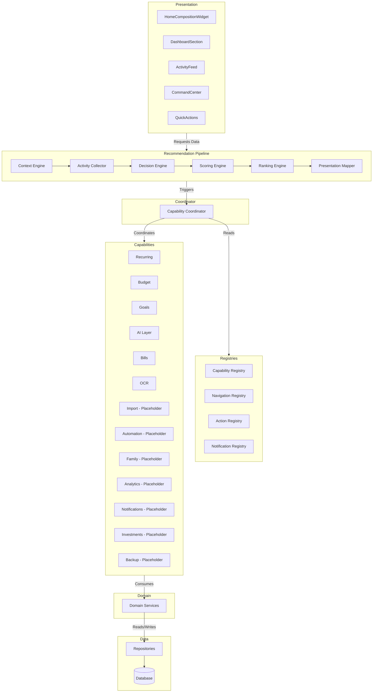

# Architecture Dependency Diagram

```mermaid
graph TD
    %% Presentation Layer
    subgraph Presentation
        HC[HomeCompositionWidget]
        DS[DashboardSection]
        AF[ActivityFeed]
        CCenter[CommandCenter]
        QA[QuickActions]
    end

    %% Recommendation Pipeline (Stateless Stages)
    subgraph RP [Recommendation Pipeline]
        CE[Context Engine]
        AC[Activity Collector]
        DE[Decision Engine]
        SE[Scoring Engine]
        RE[Ranking Engine]
        PM[Presentation Mapper]
    end

    %% Coordinator Layer
    subgraph Coord [Coordinator]
        CCoord[Capability Coordinator]
    end

    %% Registries
    subgraph Reg [Registries]
        CR[Capability Registry]
        NR[Navigation Registry]
        AR[Action Registry]
        NotifR[Notification Registry]
    end

    %% Capabilities
    subgraph Cap [Capabilities]
        Rec[Recurring]
        Bud[Budget]
        Goal[Goals]
        AIL[AI Layer]
        Bill[Bills]
        OCR[OCR]
        Imp[Import - Placeholder]
        Auto[Automation - Placeholder]
        Fam[Family - Placeholder]
        Ana[Analytics - Placeholder]
        Notif[Notifications - Placeholder]
        Inv[Investments - Placeholder]
        Back[Backup - Placeholder]
    end
    
    %% Domain Services
    subgraph Domain
        DServ[Domain Services]
    end

    %% Data Layer
    subgraph Data
        Repo[Repositories]
        DB[(Database)]
    end

    %% Flow
    Presentation --> |Requests Data| RP
    RP --> |Triggers| CCoord
    CCoord --> |Reads| Reg
    CCoord --> |Coordinates| Cap
    Cap --> |Consumes| DServ
    DServ --> |Reads/Writes| Repo
    Repo --> DB
    
    %% Internal Pipeline Flow
    CE --> AC
    AC --> DE
    DE --> SE
    SE --> RE
    RE --> PM
```
